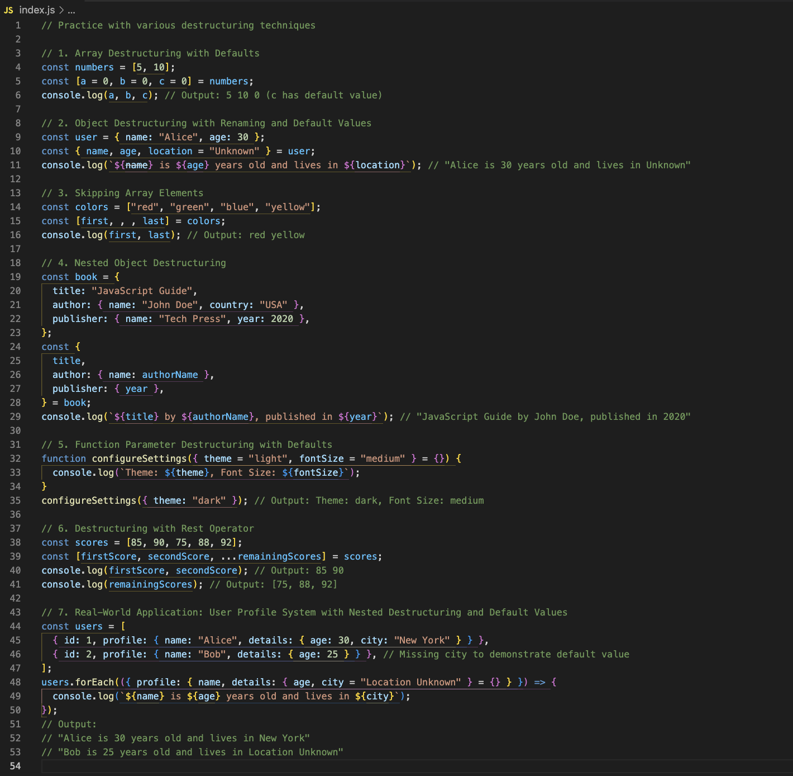

# JavaScript Advanced: Destructuring



---

## Description 📄

In this lab, we focus on **JavaScript destructuring**, a powerful feature introduced with ES6. Destructuring simplifies code by allowing direct assignment of values from arrays and properties from objects to variables. This approach enhances code readability, reduces repetition, and provides a concise way to manage complex or nested data structures.

### Key Concepts Covered:
- **Array and Object Destructuring**: Unpack values directly into variables.
- **Nested Destructuring**: Extract values from deeply nested arrays or objects.
- **Default Values**: Provide fallback values for undefined properties.

### By the end of this lab, you will:
- Understand and apply array and object destructuring.
- Work with nested destructuring for complex data.
- Use default values to handle missing or undefined data safely.

---

## Expected Project Structure 🏗️

Your project should be structured as follows:

```plaintext
destructuring-practice/
├── index.js
└── README.md
```

##

## 1. **Create the Project Folder and Files**

- [ ] Create a project folder named `destructuring-practice` to store your project files.
- [ ] Inside the `destructuring-practice` folder, create a `index.js` file. This will be your main JavaScript file where all your code will be written.

##

